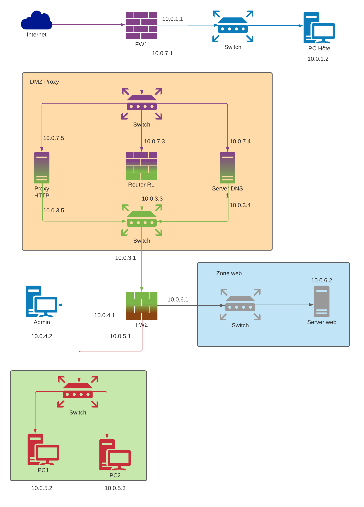

<h1 align="center">
Vagrant script for Networking and Security TP01
</h1>

<p align="center">

</p>

<p align="center">
    <a href="https://github.com/LacazeThomas/networksecurityTP01/issues/new/choose">Report Bug</a>
    ·
    <a href="https://github.com/LacazeThomas/networksecurityTP01/issues/new/choose">Request Feature</a>
</p>

[](https://github.com/anuraghazra/github-readme-stats)

## 🚧 Requirement

- [VirtualBox](https://www.virtualbox.org/wiki/Downloads)
- [Vagrant](https://www.vagrantup.com/downloads) after the installation a restart is needed !
- At least 20 gb free on your main disk

## 🔧 Tested on

- VirtualBox 6.1.18
- Vagrant 2.2.14
- Windows 10 pro

When you see a command starting with `$` it's my host machine on which is installed vagrant

And when you see `vagrant@$VM_NAME:~$` it's a VM built with vagrant

## 🛠️ Installation Steps

Clone the repo
```sh
$ git clone https://github.com/LacazeThomas/networksecurityTP01.git
```

Into `networksecurityTP01` launch vagrant to build stack
```sh
$ vagrant up
```

If you want to setup a specific host
```sh
$ vagrant up $VM_NAME
```

## ℹ️ Informations

How to connect into a vm:
```sh
$ vagrant ssh $VM_NAME
```
PS: if you want to use another ssh client see [here](#💻-Using-other-ssh-client:)

Default credential (user:password):
```
vagrant:vagrant
```

How to get ssh port:
```
$ vagrant port $VM_NAME
```

How to become root:
```sh
vagrant@hote:~$ sudo su -
```

This stack is composed of 6 networks

| #ID  | Address  |
|---|---|
| 1  | 10.0.1.0/24  |
| 2  | 10.0.2.0/24  |
|  3 |  10.0.3.0/24 |
| 4  |  10.0.4.0/24 |
| 5  | 10.0.5.0/24  |
| 6 |  10.0.6.0/24 |


All firewalls are running with Debian 10 but you probably need to change it to pfSense in the futur. (a variable is already available)

Each VM is connected with NAT and 1+ host only interfaces. Due to NAT authorization all VMs can ping each other

## 💻 Using other ssh client:

### Method 1: using password

Get the ssh port of the vm and keep it
```sh
$ vagrant port $VM_NAME
22 (guest) => 2222 (host)
```

Connect into a VM using vagrant
```sh
$ vagrant ssh $VM_NAME
```

Edit `sshd_config` and change `ChallengeResponseAuthentication` from `no` to `yes`
```sh
vagrant@admin:~$ sudo nano /etc/ssh/sshd_config
```

Reboot sshd service
```sh
vagrant@admin:~$ sudo service sshd restart
```

You can connect into a VM using default username:password
```sh
$ ssh vagrant@127.0.0.1 -p 2222
```

### Method 2: using private key

Get the ssh port of the vm
```sh
$ vagrant port $VM_NAME
22 (guest) => 2222 (host)
```

Get the private key file 
```sh
$ ssh vagrant@127.0.0.1 -p 2222 -i $YOUR_PATH\networksecurityTP01\.vagrant\machines\$VM_NAME\virtualbox\private_key
```
PS: please change PATH with yours

## 🧐 Userful commands

If you modify the `Valgrantfile`, you need to reload it without delete your vm
```sh
$ vagrant reload
```

## 🌟 You are all set! You have a problem ? Please open an issue